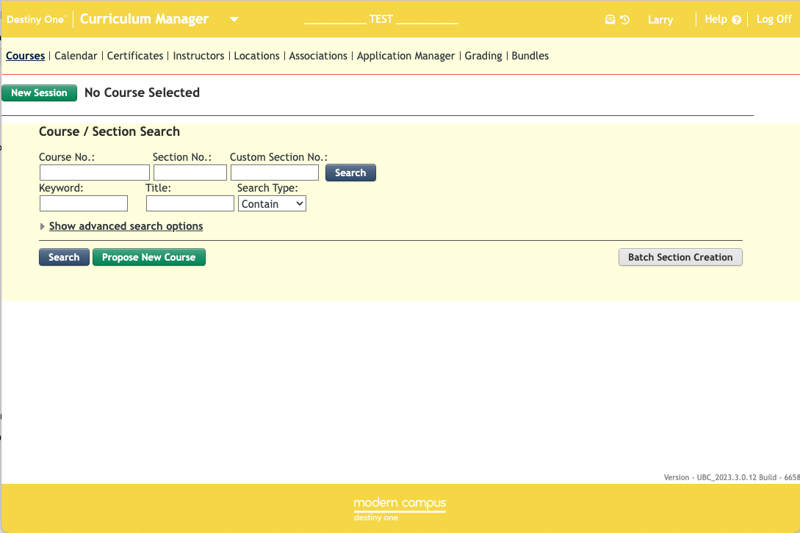

# Destiny Chrome Extension
A Chrome Extension to change the appearance of the DestinyONE Staff View TEST 
environment. Makes it abundantly obvious that you're in TEST vs PROD. [Turns the 
banner and footer yellow, and adds a light yellow background to the entire page.]

Also adds yellow banner styles to the STAGING Website, the DEV Website, and the 
DestinyOne Public View TEST.

Adapted from the UC Berkeley extension at https://github.com/UC-Berkeley-Extension/destiny-chrome-extension

Rewritten to be compatible with Manifest V3.

## Installation in Chrome
1. Download the ZIP file of this using the CODE button on the github project page. Alternatively, you may clone the project to your local environment.
2. Unzip the file into a folder on your local machine.
3. Open Chrome's Extensions page.
4. Click the Developer Mode button in the top-right of the Extensions page. 
5. Now use the *Load Unpacked* button and navigate to the folder containing this extension's code and click *Select*.
6. You're done. Navigate to the D1 test instance and you should see a yellow banner and background. 
7. You may now turn off Developer Mode and close the Extensions page. You may also delete the folder and its code from your machine if you like.

## Sreenshot

